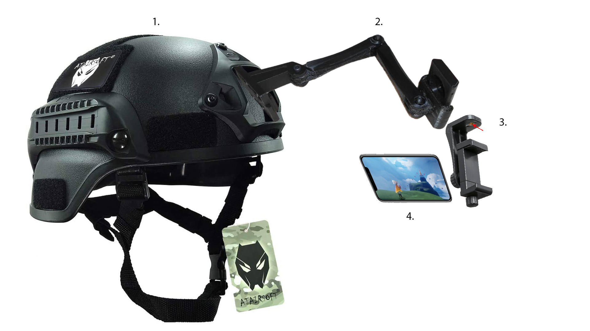
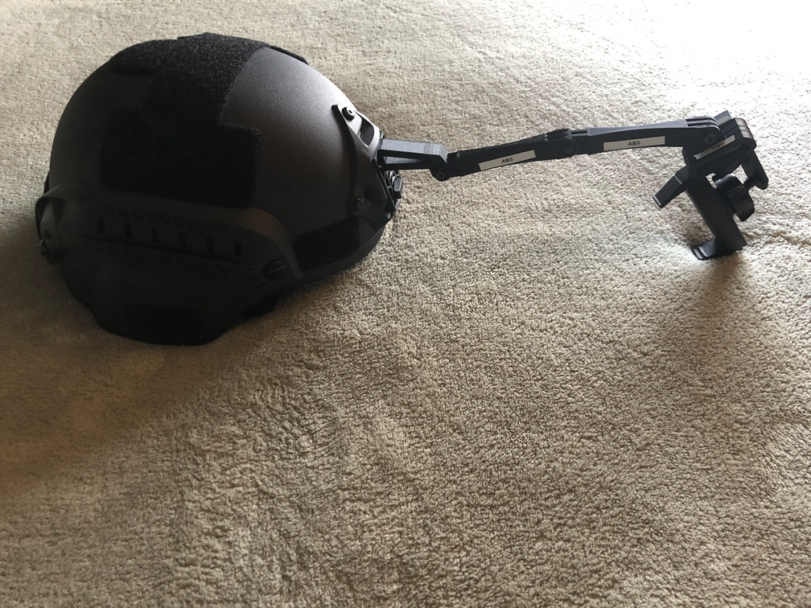
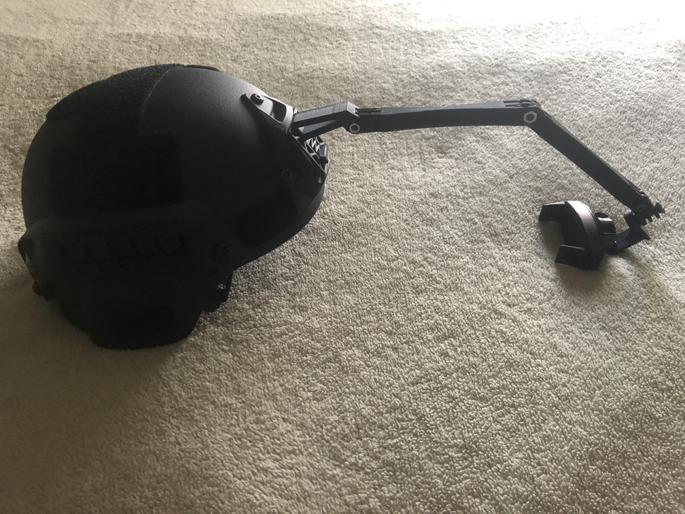
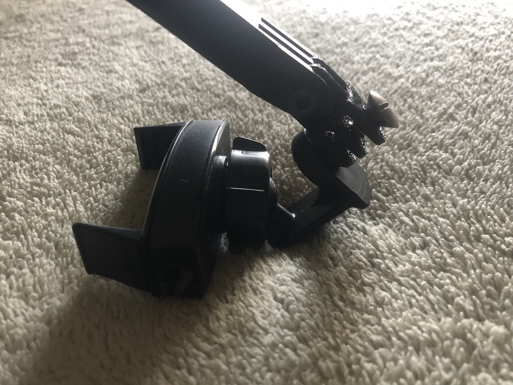

# DIY Head-Mounted Camera (HMC)

Do-it-yourself head-mounted camera - an inexpensive, 3d-printed facial animation capture rig.

### v1

### v2

## Hardware

* Tactical helmet with NVG shroud, adult-sized (~$40)

* 1/4" mount mobile phone holder (I took one from a mobile phone tripod)

* 3D-printed [NVG mount](https://www.thingiverse.com/thing:2799476)

* 3D-printed [arms](https://www.thingiverse.com/thing:2194278)

  * arm 90 straight (lengthened) - x2

  * Arm Axis Changer (drilled 1/4" hole after printing)

* M5 Nut (metal)

* M5x25 Bolt (metal)

* iPhone with ARKit (I'm using an iPhone X)

### Tips

* A counterweight pouch attached to the bottom back of the helmet can be used to reduce head strain.

## References

