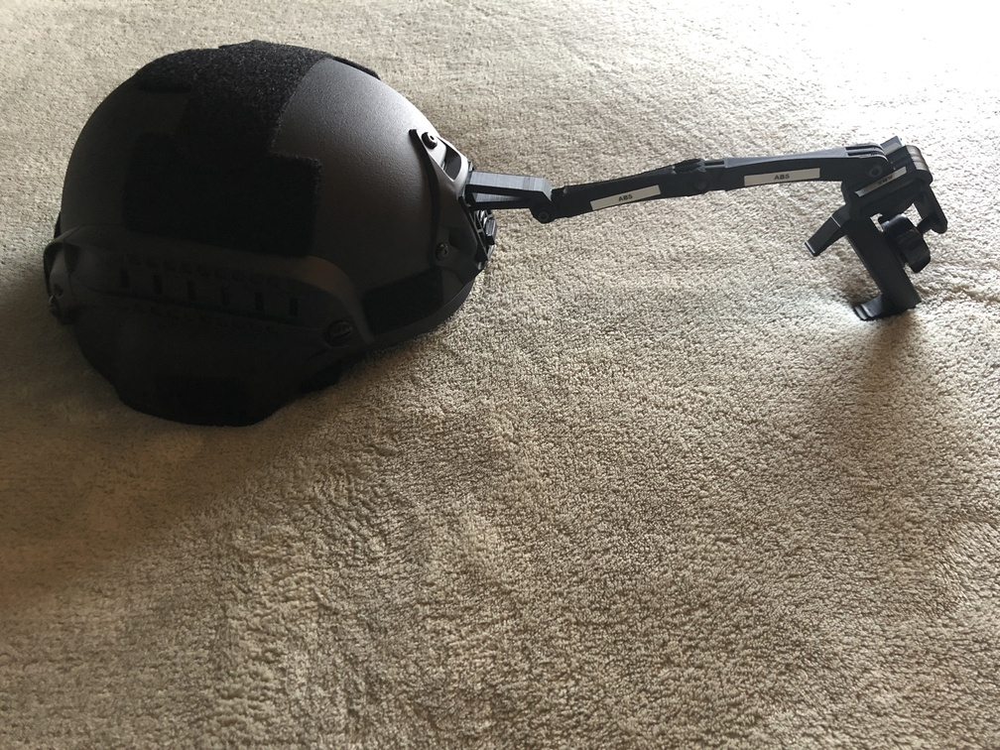
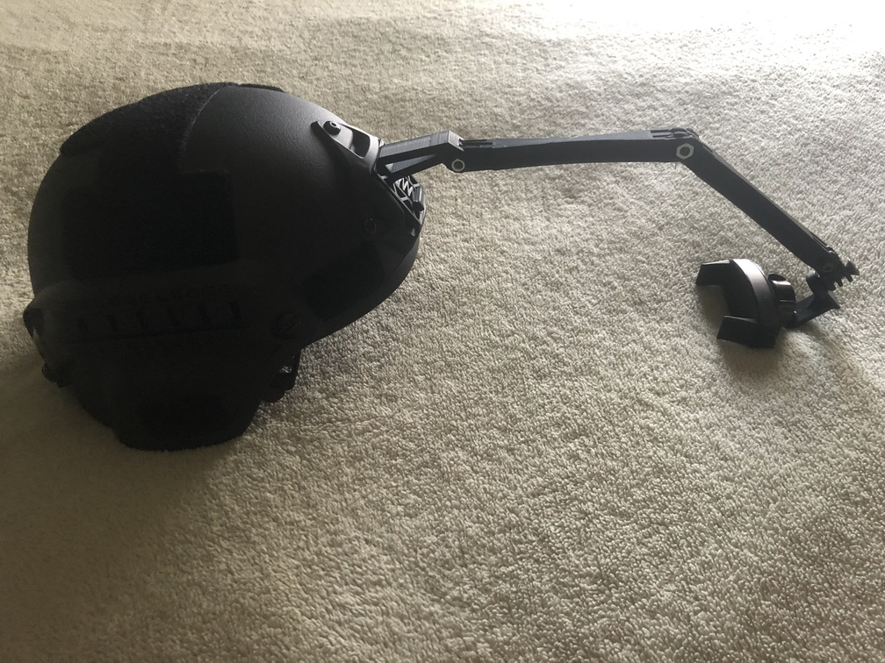

# DIY Head-Mounted Camera (HMC) Solution

Do-it-yourself head-mounted camera - an inexpensive, 3d-printed facial animation capture rig.

## Hardware

* Tactical helmet with NVG shroud, adult-sized (~$40)

* iPhone with ARKit functionality (I'm using an iPhone X)

* 1/4" mount mobile phone holder

* OPTION 1: 3d printed NVG-mounted arm (as opposed to a "selfie stick")

* OPTION 2: bendable selfie stick, possibly just duct taped to top of helmet

### Parts List for 3d-printed NVG-mounted arm

> print 3d-printed parts in black PLA

* M5 Nut (metal)

* M5x25 Bolt (metal)

* 3DPRINT [NVG mount](https://www.thingiverse.com/thing:2799476)

* 3DPRINT [just the arm of this](https://www.thingiverse.com/thing:2194278)

  * arm 90 straight - x2

  * knob for nut

  * mount camera screw

  * mount camera v5

  * mount holder single

### Tips

* A [counterweight pouch](https://www.hardheadveterans.com/blogs/reviews/combat-helmet-setup-visual-guide-for-military ) attached to the bottom back of the helmet can be used to reduce head strain.

## References

